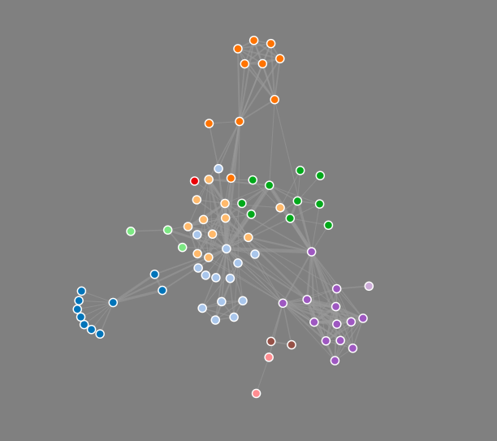

# Post App

this is my memo .  
D3.js - forces

# Overview
「user」から「post」を作ってpostに対して「repost」の返信をする。それに対して「reply」をする..  
twitterの返信機能をイメージ。  
D3.jsのforceで「user」が作った「post」で`node`を広げていく。  
イメージ図



# flow
1. 「user」を作成及び認証
2. 「name」の記入
3. 「post」を作成
4. 「repost」を作成
5. 「comment」を作成
6.  `post/show`欄にある「forceを表示」をクリック

# References
[deviseの設定](https://ticklecode.com/devise/)  
[`devise-bootstrap-views`の設定](https://qiita.com/guri3/items/8c414558085620999786)  
[hidden_field_tag](http://sakurawi.hateblo.jp/entry/hidden_field)  
[]


# Version
## 言語
- rails - 5.1.5  
- ruby - 2.4.3  
## Gem
bootstrap-sass 3.3.7
devise 4.4.1
# memo
memo  
## devise


```
app/views/devise/shared/_links.html.erb (リンク用パーシャル)
app/views/devise/confirmations/new.html.erb (認証メールの再送信画面)
app/views/devise/passwords/edit.html.erb (パスワード変更画面)
app/views/devise/passwords/new.html.erb (パスワードを忘れた際、メールを送る画面)
app/views/devise/registrations/edit.html.erb (ユーザー情報変更画面)
app/views/devise/registrations/new.html.erb (ユーザー登録画面)
app/views/devise/sessions/new.html.erb (ログイン画面)
app/views/devise/unlocks/new.html.erb (ロック解除メール再送信画面)
app/views/devise/mailer/confirmation_instructions.html.erb (メール用アカウント認証文)
app/views/devise/mailer/password_change.html.erb （メール用パスワード変更完了文）
app/views/devise/mailer/reset_password_instructions.html.erb (メール用パスワードリセット文)
app/views/devise/mailer/unlock_instructions.html.erb (メール用ロック解除文)
```
